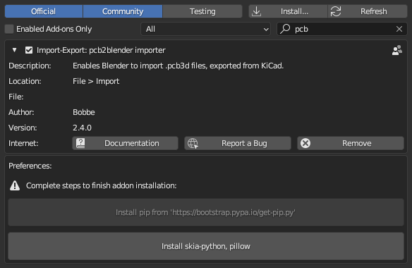

## This project has been deprecated by the introduction of the [Blender Extensions Platform](https://docs.blender.org/manual/en/latest/advanced/extensions/index.html) in Blender 4.2+

# blender_addon_utils

The blender_addon_utils module offers functionality to enable the end-users of your blender
addon to easily install pip, as well as any dependencies your addon requires.

## Documentation

Detailed documentation is available at [readthedocs](https://blender-addon-utils.readthedocs.io/en/latest/).

## Example

The end user will be presented with a panel like this, if there are missing dependencies:

For an example of an addon that uses this functionality, checkout my
[pcb2blender_importer](https://github.com/30350n/pcb2blender/tree/master/pcb2blender_importer)
addon.

## License

- This project is licensed under
  [GPLv3](https://github.com/30350n/blender_addon_utils/blob/master/LICENSE).
